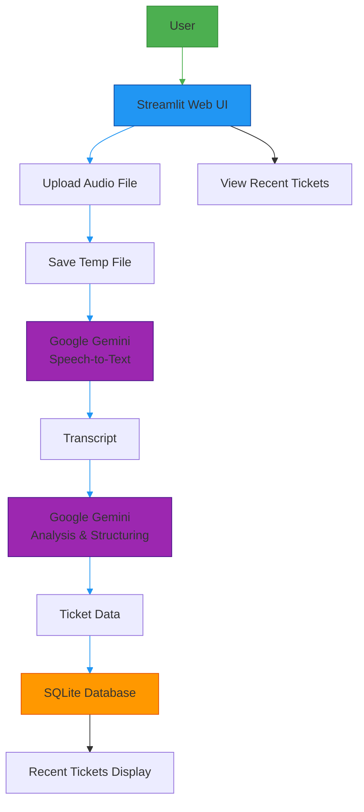

# Smart Reception AI Agent Architecture



## Component Overview

### 1. Streamlit Web UI (`app.py`)
- Main user interface for the application
- File upload functionality
- Display of results and recent tickets
- Error handling and user feedback

### 2. Audio Processing (`utils/audio.py`)
- Handles temporary file storage for uploaded audio
- File extension detection
- Temporary file cleanup

### 3. AI Processing (`ai_core.py`)
- Speech-to-text conversion using Google Gemini
- Call analysis using Google Gemini models
- Structured data extraction from transcripts

### 4. Database (`db.py`)
- SQLite database initialization
- Ticket storage and retrieval
- Recent tickets query functionality

### 5. Configuration (`config.py`)
- Application constants and settings
- Model names and categories
- Supported file formats

## Data Flow

1. **User** uploads an audio file through the **Streamlit UI**
2. The file is temporarily saved by the **Audio Utility**
3. **Google Gemini** converts the audio to text
4. **Google Gemini** analyzes the transcript to extract:
   - Intent category
   - Caller information
   - Sentiment
   - Priority
   - Department routing
   - Summaries
5. Structured ticket data is stored in **SQLite Database**
6. Results are displayed to the user
7. Recent tickets are shown in a table

## Database Schema

```sql
CREATE TABLE tickets (
    id INTEGER PRIMARY KEY AUTOINCREMENT,
    created_at TEXT NOT NULL,
    caller_name TEXT,
    caller_contact TEXT,
    intent_category TEXT NOT NULL,
    department TEXT NOT NULL,
    priority TEXT NOT NULL,
    sentiment TEXT NOT NULL,
    transcript TEXT NOT NULL,
    summary_short TEXT NOT NULL,
    summary_full TEXT NOT NULL
);
```